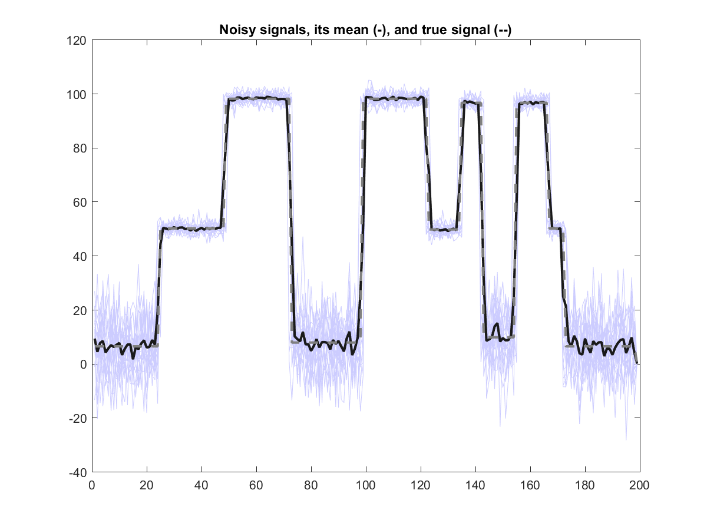
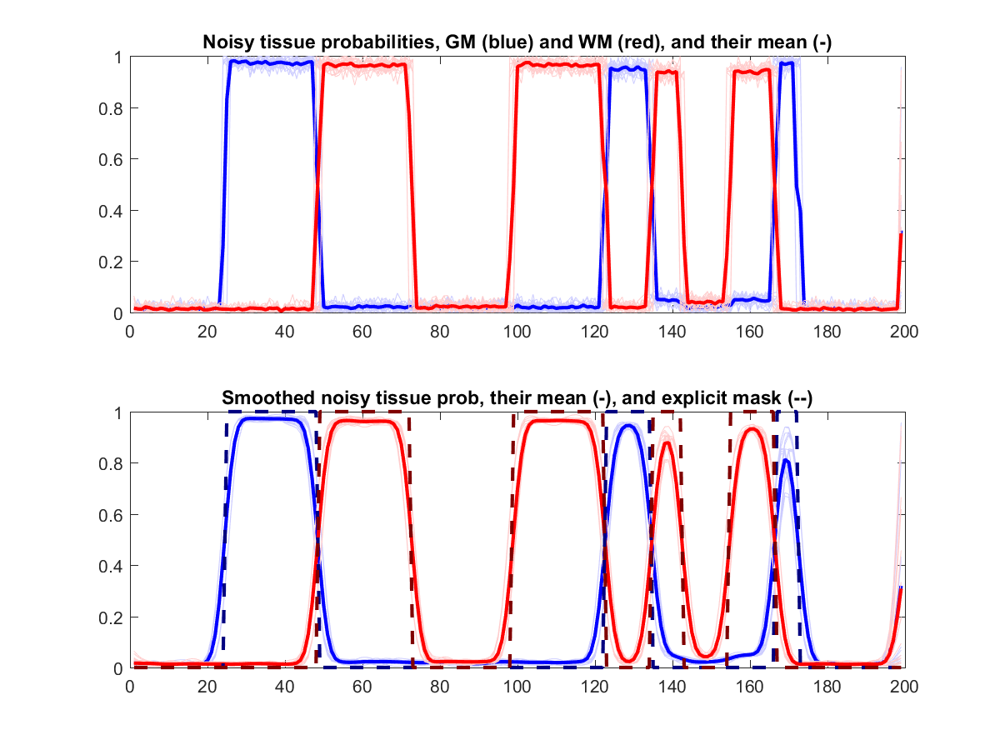

# Tissue-weighted smoothing evaluation

## Introduction

After being warped into a common space, typically a group averaged in line with the MNI space, MR images are smoothed. This is useful to : 1/ remove some high-frequency noise, 2/ reduce the multiple comparison problem, and 3/ reduce the remaining inter-subject anatomical variability.

With quantitative MRI, one is interested in the signal coming from the GM and/or the WM, standard Gaussian smoothing would therefore mix the signal coming from these 2 tissues classes, i.e. introducing some partial volume effect! One would therefore want to smooth the images "within each tissue class". Such an approach was introduced by Drangaski et al. (2011) as a specific way to smooth data in the case of "Voxel-Based Quantification" (VBQ) analysis. 

Another technique is the "*T*issue-*SP*ecific, sm*OO*thing-compe*N*sated" method, aka. T-SPOON, by Eun Lee et al. It is not considered here, at least for the moment...

## VBQ tissue-weighted smoothing
For each tissue class of interest, typically GM and WM, the quantitative map is smoothed according to the tissue class *posterior* probability. Tissue-weighted smoothing is thus defined as follow:

where:

| Parameter | Meaning  |
| ------ | -------- |
|  | Quantitative map for subject  after tissue-weighted smoothing |
|  | Participant-specific quantitative map warped to group space by deformation  |
|  | Participant-specific deformation mapping from native to group space |
|  | Participant-specific weights given by           |
|  | Jacobian determinants of deformation               |
|  | Participant-specific tissue *posterior* probability map warped by deformation  |
|  | Convolution by a Gaussian smoothing kernel, i.e. Gaussian smoothing. |
|  | TPM-specific mask identifying voxels with probability > 5%   |
|  | Participant-specific mask defined as 5\%" /> |
|  | Ratio applied voxel by voxel over the smoothed images |

The point of the 2 masks is to ensure only voxels with sufficient 

- *a priori* probability () of being of the tissue class of interest, i.e. keeping voxels that are where they are supposed to be, and 
- *a posteriori* probability () of being of the tissue class of interest, i.e. masking out voxels that are unlikely to be of the class of interest 

A further explicit mask should be defined at the group level for the statistical analysis.

## Explicit mask

For each tissue class of interest, i.e. GM and WM, an explicit mask is generated from the group-mean smoothed tissue probabilities.  The GM (resp. WM) mask includes voxels having, on average across all subjects, 

- \> 20% chance of being GM (resp. WM), and 
- larger probability of being GM (resp. WM) than CSF or WM (resp. GM), 

This explicit mask ensures that for a voxel will only appear in one tissue class, either GM or WM, the one with the largest probability (on average across the group)

## Simulation

To illustrate how classic and tissue-weighted smoothing affect the quantitative signal, we created synthetic data in 1D, for an easy visualization, for the 20 pseudo-subjects. Then the average across subject is displayed.

### Data generation

Here are the characteristics of the simulated data,:

- the profile contains segments of 3 tissue classes, say GM, WM, and CSF, with true intensity of 50, 100, and 5 resp., see the 1st figure here under;
- some "anatomical variability" is introduced by randomly shifting the edge of all the segments of the profile by -1, 0 or +1;
- each "tissue segment" has quite distinct probabilities, i.e.  >94% or <5%, but we always have >1% and the total at each voxel =100%;
- the signal is constructed by summing over the 3 tissue classes the product of the tissue probability with their corresponding intensity, and adding some random noise of standard deviation 2, 2, 10 resp.;
- some randomness is also added to the tissue class profiles but we still keep >1%$ and the total at each voxel =100%, see last figure for their profile.

There are therefore different sources of variability:

- anatomical, with edges being shifted left or right randomly;
- intensity, with some added noise in the signal;
- tissue class, with some added noise in the probability.

### Data smoothing & averaging

For each subject, 

- the signal is smoothed using a (standard) Gaussian kernel and using the tissue-weighted method for the GM and WM. The smoothing kernel with is 8 voxels.
- the tissue probabilities are also smoothed using the same Gaussian kernel.
- finally these signals, original and smoothed, and tissue probabilities are averaged.

### Discrepancy measurement

The Root Mean Square Error (RMSE) for GM and WM, over their respective explicit mask, is also calculated for the (mean noisy) signal smoothed with the standard Gaussian and the tissue-weighted method.

where

| Parameter          | Meaning                                      |
| ------------------ | -------------------------------------------- |
|  | Root Mean Square Error for tissue class  |
|  | Explicit mask for tissue class  |
|  | True signal at voxel  |
|  | Averaged (over 20 subjects) signal with/without smoothing at voxel  |
|  | Number of voxels in explicit mask for tissue class  |

## Results

### Signal and tissue class profiles

- Signal from the 20 subjects, thin lines, and the average signal intensity bold black line. The true underlying signal is represented by the dashed-grey line. From left to right, each segment contains the following tissue with width (vx): CSF (24), GM (24), WM(24), CSF (26), WM (24), GM (12), WM (8), CSF (12), WM (12), GM (6), CSF (26). Some segments are quite broader than the smoothing kernel (8) but others are of equivalent size (12 or 8) or even a bit smaller (6)

  One can see the variability in signal intensity and some "fussiness" close to the edges. Even when averaging the noisy signal from the 20 subjects, there remains some variability.
  
- The signal from the 20 subjects, thin lines, and the mean signal intensity, bold line, smoothed with the Gaussian kernel.
	
  One can see the mixing effect of standard Gaussian smoothing. The signal close to the edges (between tissue classes) is strongly affected and deviated from the true signal (dashed line).
  
- The signal from the 20 subjects, thin lines, and the mean signal intensity, bold line, smoothed with the tissue-weighted method with, in blue, the GM and, in red, the WM tissue, after explicit masking (for GM and WM). 
	
  One can notice that the the signal is relatively homogeneously smoothed within each tissue class and only deviates slightly from the true signal very close to the edges (between tissue classes).
  
- Tissue probabilities, with noise (top) and after Gaussian smoothing (bottom), with the corresponding explicit mask (bottom, dashed line) with, in blue, the GM and, in red, the WM tissue. .
	
  This simply illustrates the fact that the tissue probabilities are also affected by the standard Gaussian smoothing, still the explicit mask ensures that the location of the underlying tissue classes is correctly recovered.

### Root mean square error

RMSE for the 2 tissue classes, over their explicit mask, and for the Gaussian and tissue-weighted (TW) smoothing.

|   | No smoothing | Gaussian smoothing | TW smoothing | Ratio of  no-sm/TW-sm | Ratio of  G-sm/TW-sm |
| --- | --- | --- | --- | --- | --- |
| **GM** | 6.56 | 8.49 | 0.58 | 11.41 | 14.77 |
| **WM** | 7.57 | 11.20 | 0.61 | 12.57 | 19.47 |

## Discussion

With the tissue-weighted smoothing, the averaged smoothed signal within each explicitly mask tissue segment is very close to the original signal. Some deviation are visible close to the edges, especially for the small segments compared to the Gaussian kernel size, e.g. WM segments, of width 8 and 12, and GM segments, of size 6 and 12, on the right side of the profiles. With the standard smoothing tissue edges are completely erased and the signal mixed up between compartments.

The RMSEof the averaged noisy signal (over the 20 subjects) without smoothing is a measure of the remaining noise and the aim of the smoothing is to reduce that noise.
The RMSE using the tissue-weighted smoothing and explicit masking is very small, compared to the true signal intensity (50 and 100 for GM and WM respectively) and that of signal without smoothing. On the contrary, with the standard Gaussian smoothing, the RMSE is much larger, about 14 to 20 times larger, and increased compared to without smoothing !

## Conclusion

Tissue-weighted smoothing does make a huge difference, compared to Gaussian smoothing: the signal over the explicit mask is very close to the true underlying signal. 

At least this is the case in this simple simulation.

## References
- Draganski et al. (2011), "Regional specificity of MRI contrast parameter changes in normal ageing revealed by voxel-based quantification (VBQ)."
  https://doi.org/10.1016/j.neuroimage.2011.01.052
- Callaghan et al. (2014), "Widespread age-related differences in the human brain microstructure revealed by quantitative magnetic resonance imaging."
  https://doi.org/10.1016/j.neurobiolaging.2014.02.008
- Eun Lee et al. (2009), "A study of diffusion tensor imaging by tissue-specific, smoothing-compensated voxel-based analysis."
  https://doi.org/10.1016/j.neuroimage.2008.09.041
